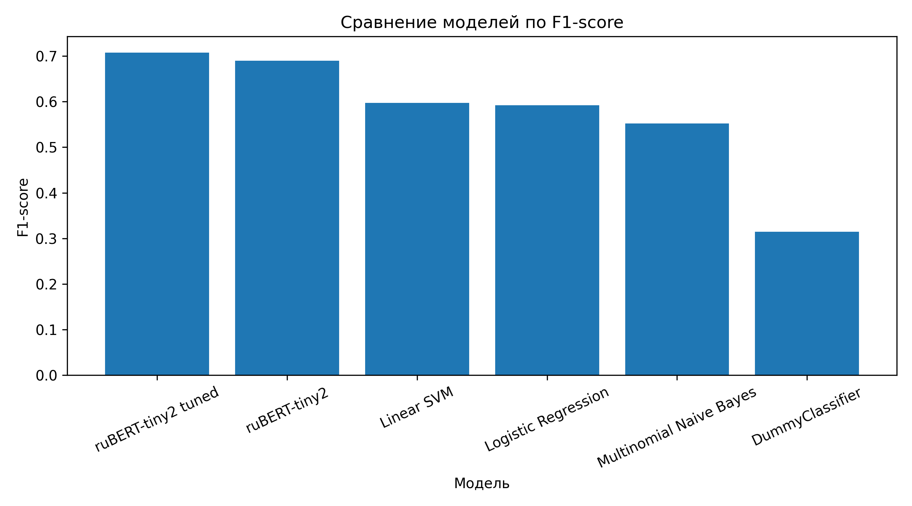
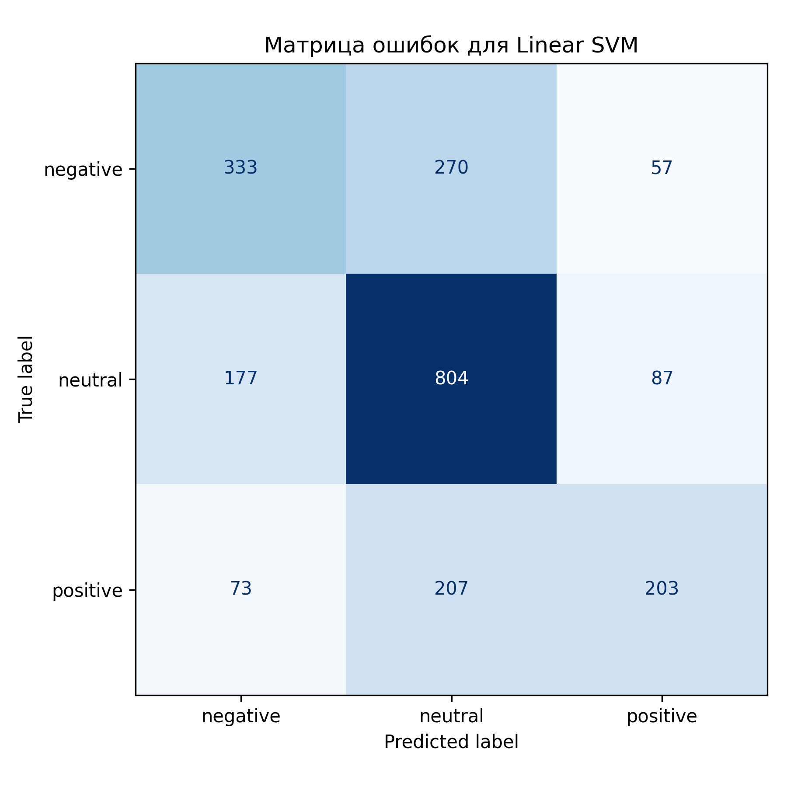
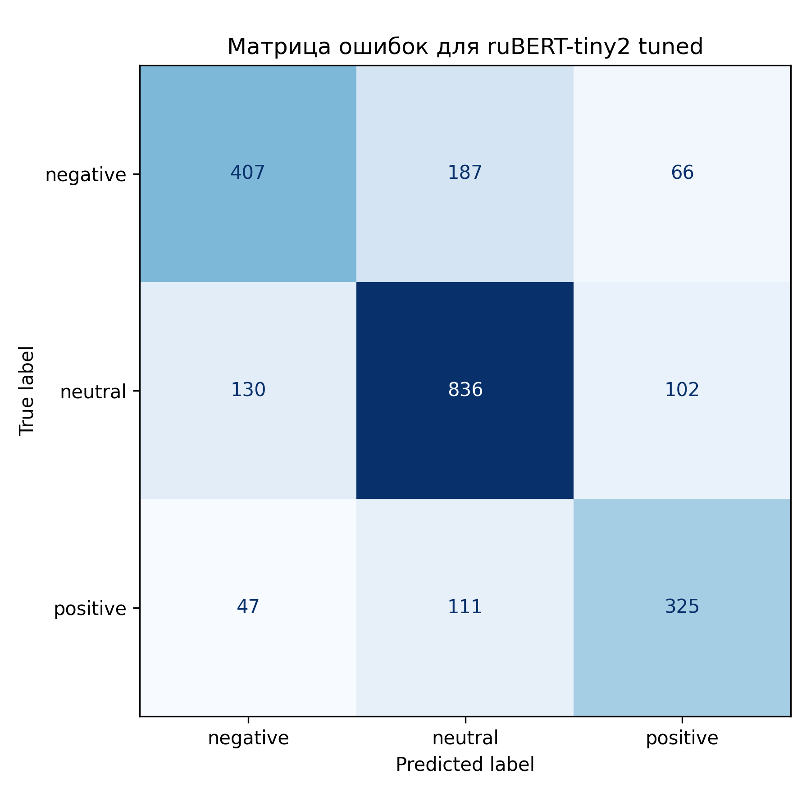

# Анализ эмоционального окраса русскоязычных текстов

## Описание проекта
Проект посвящён задаче классификации эмоциональной окраски русскоязычных коротких текстов.

В рамках исследования проводится сравнение:
- классических методов машинного обучения на основе TF-IDF,
- трансформерных моделей.

## Цель
Исследовать, какие методы лучше подходят для классификации эмоциональной окраски русскоязычных коротких текстов.

## Использованные данные
В работе использовался датасет **RuSentiTweet**.

Для эксперимента были оставлены три класса:
- `negative`
- `neutral`
- `positive`

Классы `speech` и `skip` были исключены на этапе предобработки.

## Исследованные модели

### Классические модели
- DummyClassifier
- Multinomial Naive Bayes
- Logistic Regression
- Linear SVM

### Трансформерные модели
- ruBERT-tiny2
- ruBERT-tiny2 tuned

## Основные результаты

Лучшая классическая модель:
- **Linear SVM** — F1-score = **0.5975**

Лучшая трансформерная модель:
- **ruBERT-tiny2 tuned** — F1-score = **0.7076**

Таким образом, трансформерная модель показала заметное улучшение качества по сравнению с классическими подходами.

Прирост качества по сравнению с лучшей классической моделью составил более **0.11 по F1-score**.

## Визуализация результатов

### Сравнение моделей

### Матрица ошибок для Linear SVM

### Матрица ошибок для ruBERT-tiny2 tuned

## Структура проекта
- `notebooks/` — ноутбук с экспериментами
- `artifacts/` — таблицы, графики, матрицы ошибок, отчёты
- `models/` — сохранённая лучшая модель
- `data/` — описание используемых данных
- `requirements.txt` — зависимости проекта

## Основные материалы
- итоговая таблица результатов моделей
- график сравнения моделей по F1-score
- матрица ошибок для Linear SVM
- матрица ошибок для ruBERT-tiny2 tuned
- classification report для ruBERT-tiny2 tuned

## Запуск

1. Установить зависимости:

`pip install -r requirements.txt`

2. Открыть ноутбук из папки `notebooks/` и выполнить ячейки по порядку.

## Вывод
Проведённое исследование показало, что трансформерные модели, использующие контекстные представления текста, превосходят классические методы машинного обучения на основе TF-IDF в задаче классификации эмоциональной окраски русскоязычных коротких текстов.
